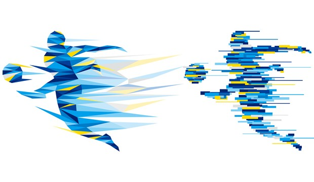

<!-- This won't be displayed but it will initialize your R session. Add any R libraries you need here. -->
```{r init,include=FALSE,echo=FALSE}
library(magrittr)
```


# Welcome! {-}

<!-- You can include images saved within your repo... -->
```{r sports,echo=FALSE,fig.cap='Sports, driven by data',fig.align='center',out.width='50%'}

```

Welcome to my website!

<!-- Below this line is just examples of how you can embed video from Google Drive. First you have to enable sharing, then just get the object ID which is that long string between d/ and /preview and will also be appended to any sharing link you generate for your video. -->
<p>
```{r hello-benji,echo=FALSE,fig.cap='Fandemonium!',fig.align='center'}
knitr::include_url('https://drive.google.com/file/d/148-6d4JfPBNqcm-4r2fjys0Gzp5buPUt/view?usp=sharing')
```

### Abstract - Fandemonium {-}

The object of the typical daily fantasy league is simple: given a set salary, draft the best possible roster and hope that your team scores more points than your opponents' teams to win cash. Yet, 89.3% of players lose money in a given season. Fandemonium is a Vegas bookie in your pocket; it's an artificial intelligence-enhanced mobile and web app that harnesses the power of predictive analytics to analyze the roster of available players for a given sport, salary per player, current and projected stats, current injuries, upcoming games, and more to suggest the draft lineup likely to earn the most points and win you money. On average, Fandemonium users win 12% more often and 23% more cash in a given season than daily fantasy players who do not use our advanced technology.

### Abstract - Coach's Companion {-}

One play can be the difference between a win or a loss in American football (just ask the 2014 Seahawks Superbowl team). The Coach's Companion is a tool designed to help North American football organizations (specifically those within the NFL) make the best play call at any given time during a game. The Coach's Companion has access to the last three years of NFL play data, including in-game time, score differential, distance to first down, distance to goal, opposing team defensive stats, and possessing team quarterback stats for every play run in regular season games. The Companion also continues to collect play data and retrain its algorithms over time, meaning that it will continue to get smarter and make more intelligent recommendations as the teams and league evolve. 
  
## About the author {-}

Jennifer Podracky is a sports data nerd currently pursuing a Masters of Information in Data Science at the UC Berkeley School of Information. She is also working full-time as Product Manager at Fan Manager, a sports marketing and analytics startup based in Boston, MA. Jenni spends her free time working on data science projects, cooking, and binge-watching Stranger Things.

*Updated: `r Sys.Date()`*
